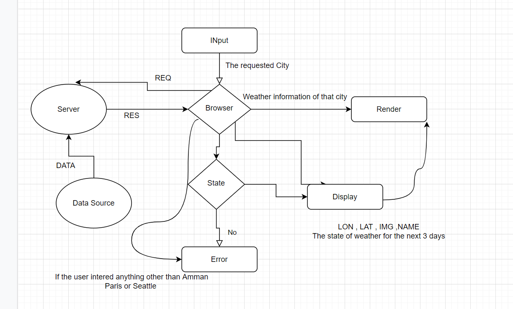

# city-explorer-api

# Project Name

**Author**: Asad Hijawi

## Overview
we are amaking an api which has 3 cities data and are ready to get requeted by making them into a class, once the user input a city name in the front end and search for it the request should be sent using the servers link and query then rendering the data that was responded with nad if the place name entered not in the data, it will give an error.

## Getting Started
making the server codea and info, make sure to know what exactly you want to display so you get it sent from the server to the frontend, make the frontend code to render the data wanted as a website and make sure it can request the data from the server.

## Architecture
i made two file one for the server(using JS, .env, cors, node express) and the other for the frontend(using react, axios, bootstrap)

## Change Log
<!-- Use this area to document the iterative changes made to your application as each feature is successfully implemented. Use time stamps. Here's an example:

01-01-2001 3:00 am - Application now has a fully-functional express server, with a GET route for the location resource. -->

## Credit and Collaborations
Credits to Bashar Nobeh 

***
Time Estimates

Name of feature: Server, FrontEnd app to render the data

Estimate of time needed to complete: 10 hours

Start time: 2 pm

Finish time: 3 am

Actual time needed to complete: 13 hours
